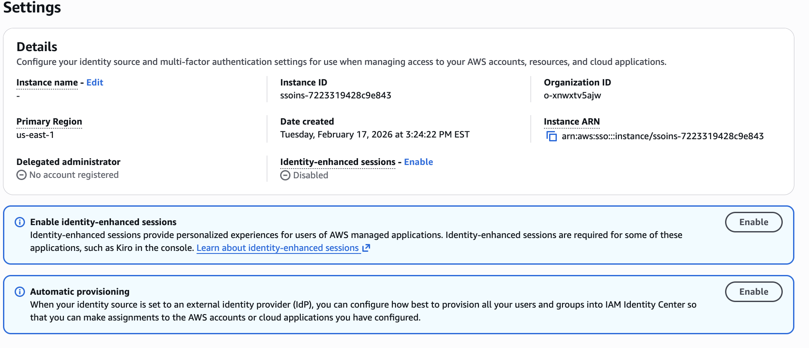
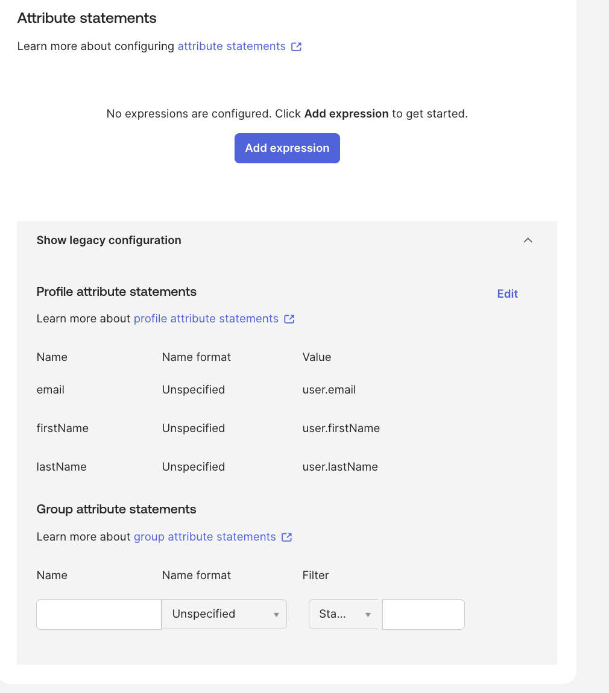

# 🔁 Okta → AWS Just-In-Time (JIT) Provisioning Lab

## Overview

This lab demonstrates **Just-In-Time (JIT) user provisioning** between Okta (Identity Provider) and AWS IAM Identity Center (Service Provider).

Unlike SCIM pre-provisioning, JIT provisioning creates the AWS user account **at the moment of first successful SAML authentication**, using attributes sent in the SAML assertion.

This lab validates that:

- The user does NOT exist in AWS before login
- The user exists in Okta and is assigned the AWS app
- Login via AWS access portal triggers SAML
- AWS auto-creates the user from SAML attributes
- Permission sets are applied after creation

---

## Identity Model Comparison

| Provisioning Method | User Created Before Login | User Created At Login | Created By |
|---------------------|---------------------------|------------------------|------------|
| SCIM                | ✅ Yes                    | ❌ No                 | SCIM       |
| JIT (SAML)         | ❌ No                     | ✅ Yes                | External IdP / SAML |

---

## Architecture Flow

1. User navigates to AWS Access Portal (SP-initiated login)
2. AWS redirects to Okta for authentication
3. Okta issues SAML assertion containing identity attributes
4. AWS IAM Identity Center:
   - Detects user does not exist
   - Creates user from SAML attributes (JIT)
5. Group → Permission Set mapping applies
6. User gains AWS account access

---

## Configuration Steps

### 1️⃣ Confirm SCIM Disabled (for pure JIT demonstration)

AWS → IAM Identity Center → Settings → Automatic Provisioning  
SCIM disabled to ensure users are not pre-provisioned.

📸 Screenshot:

---

### 2️⃣ Verify Okta SAML Attribute Statements

Okta → Applications → AWS IAM Identity Center → Sign On → SAML Settings

Required attributes:

- NameID → user.email
- email → user.email
- firstName → user.firstName
- lastName → user.lastName

📸 Screenshot:

`images/okta-saml-attributes.png`

---

### 3️⃣ Validate User Does Not Exist in AWS

AWS → IAM Identity Center → Users

Confirmed test user is not present prior to login.

📸 Screenshot:
`images/pre-login-no-user.png`

---

### 4️⃣ Perform SP-Initiated Login

Used AWS Access Portal URL:

https://d-906600b513.awsapps.com/start

User authenticated via Okta.

---

### 5️⃣ Validate JIT Creation in AWS

After login:

AWS → IAM Identity Center → Users

User now exists and shows:

- Created by: External identity provider
- Status: Enabled
- Timestamp matches login time

📸 Screenshot:
`images/aws-user-created-jit.png`

---

### 6️⃣ Validate Permission Assignment

Confirmed user received expected AWS Permission Set via group mapping.

📸 Screenshot:
`images/validation-portal-role.png`

---

## Evidence from Logs

### Okta System Log

Verified SAML assertion event containing identity attributes.

📸 Screenshot:
`images/okta-systemlog-saml-assertion.png`

---

### AWS CloudTrail

Verified `AssumeRoleWithSAML` event for the test user.

📸 Screenshot:
`images/aws-assumerole-saml.png`

---

## Security Concepts Demonstrated

- Federation-driven identity instantiation
- Attribute-based identity creation
- SAML NameID dependency
- SP-initiated authentication flow
- Reduced pre-provisioned account footprint
- JIT onboarding model
- Identity lifecycle comparison (SCIM vs JIT)

---

## Lessons Learned

- JIT requires accurate SAML attribute mapping
- SCIM must be disabled (or controlled) to demonstrate pure JIT
- SP-initiated login ensures correct evaluation order
- System Log is essential for debugging SAML assertions
- IAM Identity Center does not create users unless valid attributes are present

---

## Outcome

Successfully demonstrated:

- AWS user creation at first login via SAML
- Correct identity attribute mapping
- Automatic permission set application
- Validation through logs and console evidence

This lab showcases advanced identity federation and provisioning design concepts used in enterprise IAM environments.

---

## Author

Brianna Wandt  
Identity & Access Management Portfolio Lab
